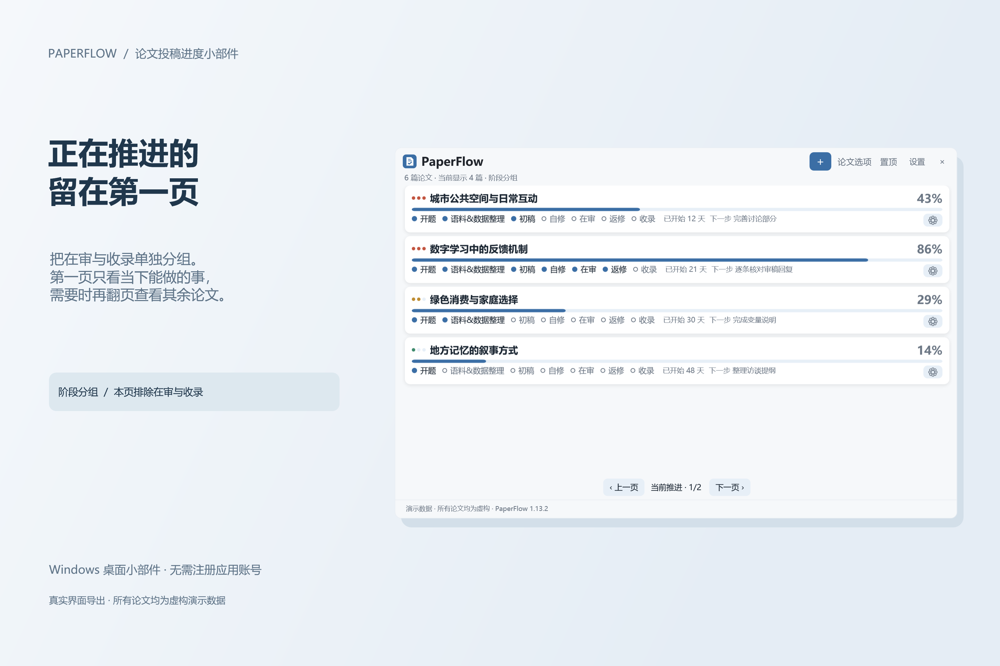
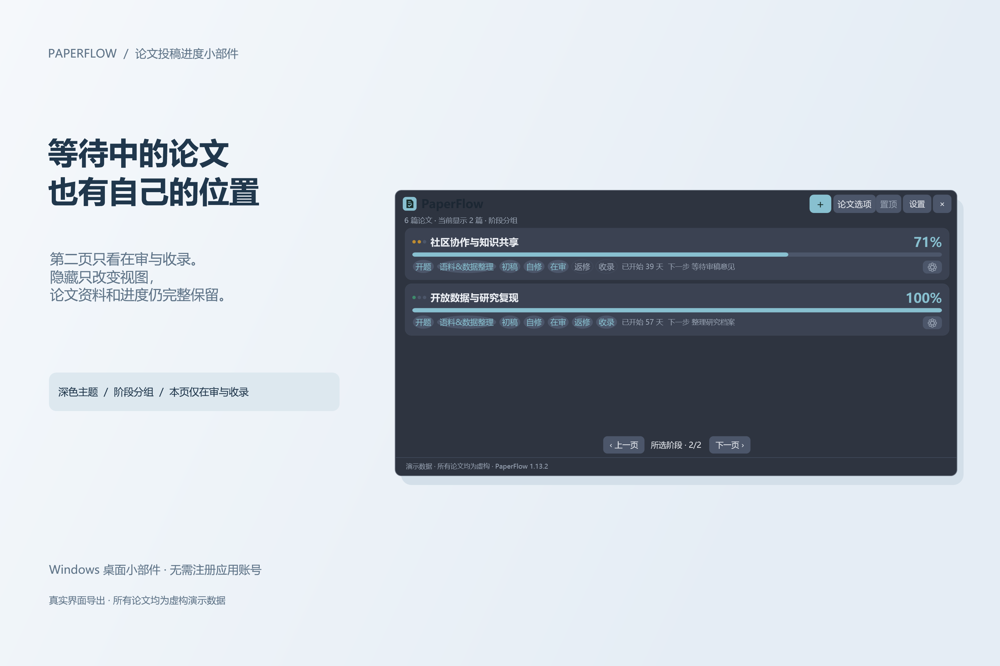

# PaperFlow · 论文投稿进度小部件

一个安静的 Windows 桌面小部件：把正在投的论文摆在一起，点一下就更新进度，一眼看得出哪篇卡在哪一步。

不需要注册账号，不打开也不用联网；论文数据只存在你自己的电脑上。

## 下载

在 [Releases](https://github.com/pwya/paperflow/releases) 页面下载最新的 `PaperFlow-<版本>-win-x64.zip`，解压到任意文件夹，双击里面的 `PaperFlow.Launcher.exe` 就行。自带运行环境，不需要另外安装什么；面向 Windows 10 / 11（x64）。

程序没有购买代码签名证书，所以**第一次打开时 Windows 可能弹一个蓝色的 SmartScreen 提示**：点“更多信息”，再点“仍要运行”，之后不会再问。介意这一点的话可以自己从源码构建。

## 怎么用

- 点右上角 `＋` 输入论文标题，七个阶段和进度条会自动准备好。
- 每篇论文下面就是七个阶段，点一下打勾，进度条跟着走。没有返修环节的论文，可以在资料里把返修设为不适用。
- 标题最左边的三个点表示优先级：三个点高、两个点中、一个点低。点它可以改，按住拖动可以调整论文顺序。
- 卡片右下角的齿轮是这篇论文的完整资料：学科、合作者、目标期刊、当前状态、下一步、截止日期、备注和修改记录。
- 右上角两个入口分工不同：`论文选项` 管你此刻看到什么（搜索、筛选、排序、翻页），`设置` 管长期偏好（主题、字号、背景图、界面语言、更新提示、开机启动）。
- 点 `×` 只是收进系统托盘，双击托盘图标就能叫回来；要完全关闭请用托盘右键菜单里的“退出”。

## 长什么样

**一眼看清进度** —— 纸感主题，多篇论文同屏，右下角统一放论文设置。

**先做重要的事** —— 高、中、低三档优先级，阶段按类别分色，可以按优先级翻页。

**正在推进的留在第一页** —— 按阶段分组翻页，把在审和收录单独放到第二页。

**等待中的论文也有自己的位置** —— 第二页只看在审与收录，隐藏只改变视图，资料和进度都完整保留。

**调成你自己喜欢的样子** —— 二十多套主题、五种排版风格，可以跟随 Windows 的浅色/深色；字号与界面缩放分开调，标题、正文、次要三档能各选字体和颜色，也可以放一张自己的背景图。

**论文多的时候一屏看更多** —— 换成列表布局，去掉卡片，只用一条分隔线。

界面有中文和英文两版，在 设置 → 外观 → 界面语言 里切换。

## 更新

有新版时，窗口底部会出现一行提示：点“下载并安装”就会下载、校验并重启生效；不想被提醒的话，在 设置 → 同步与启动 里把更新提示设成“每天一次”或“不提示”。检查更新只读 GitHub 上的一份清单，只下载、不上传，不会把论文信息发出去。

## 反馈

遇到问题或者想提建议：发邮件到 **pwya1998@126.com**，或者在 [Issues](https://github.com/pwya/paperflow/issues) 里开一条（截图和文字都可以）。

MIT 许可。源码就在本仓库；构建与发布流程见 [docs/RELEASING.md](docs/RELEASING.md)，图标由仓库脚本生成、不含外部品牌素材。
