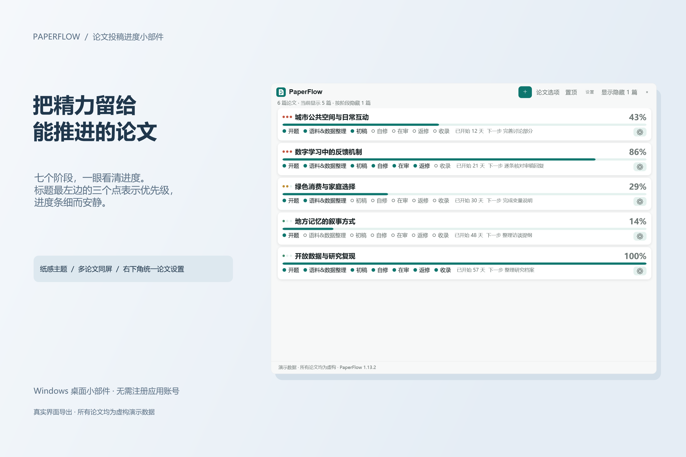
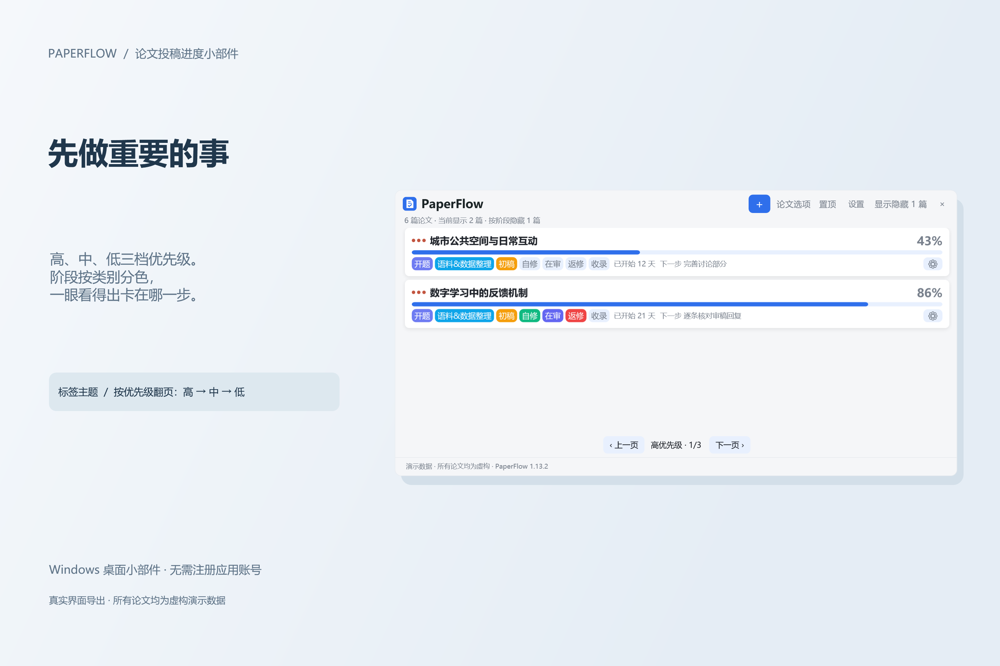
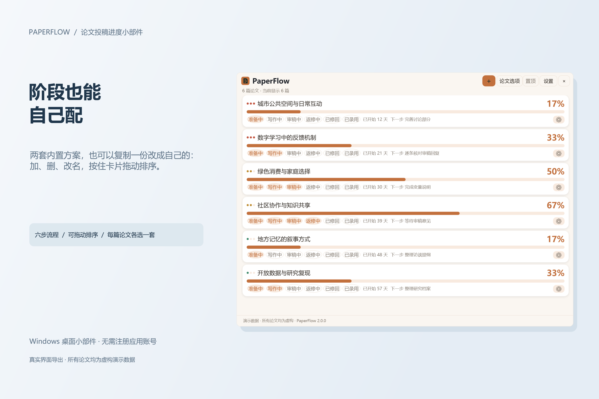
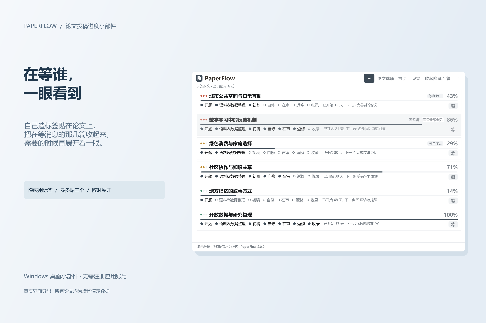
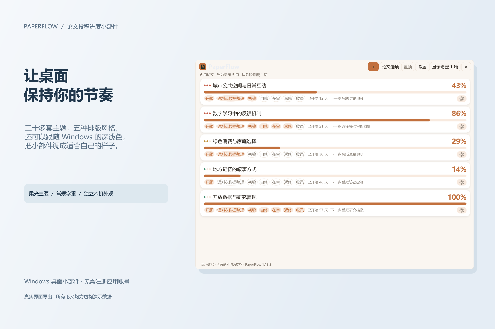
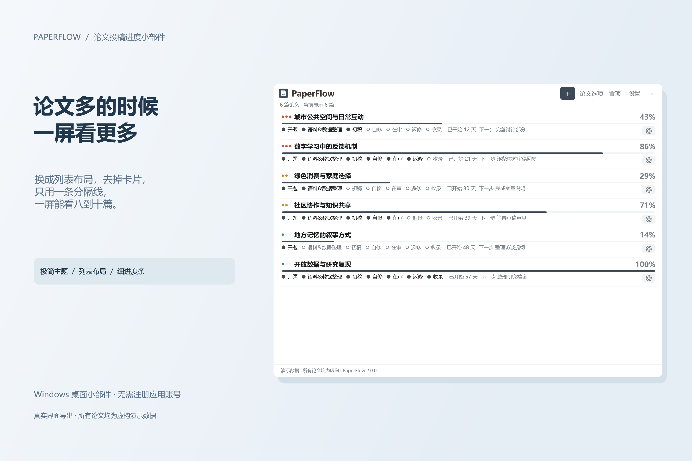

# PaperFlow · 论文投稿进度小部件

一个安静的 Windows 桌面小部件：把正在投的论文摆在一起，点一下就更新进度，一眼看得出哪篇卡在哪一步。

默认常驻桌面，按 **Win+D** 回到桌面后仍能看到，也能直接勾选进度。窗口可以缩到一篇论文大小，其余论文向下滚动查看；拉大窗口，就能同时看到更多。

## 怎么下载

**在 GitHub 下载**

1. 点本页右上方的 **Releases**（或直接打开 https://github.com/pwya/paperflow/releases ）。
2. 在最上面那个版本（标题是 `PaperFlow x.y.z`）下面找到 **Assets**，点开它。
3. 点 `PaperFlow-x.y.z-win-x64.zip` 下载。
4. 解压到一个文件夹，双击里面的 **`PaperFlow.Launcher.exe`** 就能用。

**在 Gitee 下载（国内更快）**

1. 打开 https://gitee.com/pan-wang-yuang/paperflow 。
2. 点页面上方的 **发行版**。
3. 点最新那个版本，在附件里下载 `PaperFlow-x.y.z-win-x64.zip`。
4. 解压，双击 `PaperFlow.Launcher.exe`。

程序自带运行环境，不需要另外安装什么。支持 Windows 10 / 11（64 位）。

## 怎么用

- 点右上角 `＋` 输入论文标题，阶段和进度条会自动准备好。
- 每篇论文下面就是它的阶段，点一下打勾，进度条跟着走；也可以进入“论文资料”勾选阶段，点“保存资料”后生效。哪一步不用走，可以在资料里把它设为"不适用"。
- **阶段可以自己配**：程序自带两套方案（标准七步、六步流程），也可以在 设置 → 阶段方案 里复制一份改成自己的——加、删、改名、按住拖动排序；每篇论文各选一套，换方案时同名阶段会保留勾选。
- **等消息的论文可以收起来**：在 设置 → 视图与分页 里造几个短标签（比如"等老师反馈""等编辑部意见"），贴到论文上，再勾选要收起的标签（论文选项里）；右上角的"显示隐藏 N 篇"随时能把它们翻出来看一眼。
- 标题最左边的三个点表示优先级：三个点高、两个点中、一个点低。点它可以改，按住拖动可以调整论文顺序。
- 卡片右下角的齿轮是这篇论文的完整资料：学科、合作者、目标期刊、当前状态、下一步、截止日期、备注和修改记录。
- 右上角两个入口分工不同：`论文选项` 管你此刻看到什么（搜索、筛选、排序、按标签收起、翻页），`设置` 管长期偏好（主题、字号、背景图、阶段方案、标签、界面语言、更新提示、开机启动）。
- 点 `×` 只是收进系统托盘，双击托盘图标就能叫回来；要完全关闭请用托盘右键菜单里的“退出”。
- 拖动窗口边缘可以调整宽高，位置和大小会记住。缩小只改变可见范围，不减少论文；分页仍只按优先级，页内可以滚动。
- 设置 → 视图与分页 → 窗口显示方式，可以选择“桌面常驻”“普通窗口”或“始终置顶”。默认桌面常驻，浏览器、Word 等窗口可以盖住它；想一直显示在其他软件上方，再开启置顶。
- **只想留个提醒，可以开启极简模式**：设置 → 外观 → 显示模式 → 极简模式，每篇只显示标题和进度；双击标题进入资料页，右键打开论文菜单。顶部的 `⋯` 菜单可以新增论文、打开设置或切回完整模式。“论文选项”中也能切换，模式会在本机记住。
- **集中查看已归档论文**：在顶部“论文选项”、单篇论文右下角菜单或极简模式 `⋯` 菜单中点击“查看全部归档论文”。独立窗口不受挂件隐藏、筛选和分页影响，可搜索标题、编辑资料、恢复到列表或删除；恢复后仍遵循挂件原来的显示设置。
- **删除论文记录**：在论文资料页或右下角菜单点击“删除论文”，确认框默认选中取消；确定后会从 PaperFlow 移除，并同步到其他设备。应用内不可撤销，旧编辑与同编号的旧备份不会恢复该记录；想暂时收起请用归档。同步日志和既有备份不会因删除而自动清理，旧版客户端需升级才能完整应用删除。

界面有中文和英文两版，在 设置 → 外观 → 界面语言 里切换。有新版本时窗口底部会出现一行提示：点"下载并安装"会先显示这一版改了什么，看清楚了再决定要不要装；装好重启后还能再看一次，不需要重新下载压缩包。

## 长什么样

**一眼看清进度** —— 纸感主题，多篇论文同屏，右下角统一放论文设置。

**先做重要的事** —— 高、中、低三档优先级，阶段按类别分色，可以按优先级翻页。

**阶段也能自己配** —— 两套内置方案，也可以复制一份改成自己的；加、删、改名、按住拖动排序，每篇论文各选一套。

**在等谁，一眼看到** —— 自己造标签贴在论文上，把在等消息的那几篇收起来；需要时再展开看一眼。

**调成你自己喜欢的样子** —— 二十多套主题、五种排版风格，可以跟随 Windows 的浅色/深色；字号与界面缩放分开调，标题、正文、次要三档能各选字体和颜色，也可以放一张自己的背景图。

**论文多的时候一屏看更多** —— 换成列表布局，去掉卡片，只用一条分隔线。

## 反馈

遇到问题或者想提建议：发邮件到 **pwya1998@126.com**，或者在 [Issues](https://github.com/pwya/paperflow/issues) 里开一条（截图和文字都可以）。

## 关注公众号

公众号会写论文与投稿、AI 工具，以及这类自己做的小程序。

MIT 许可。源码就在本仓库。
